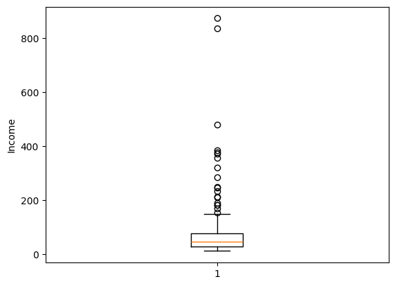

### What is Machine Learning

Machine learning (ML) is a branch of artificial intelligence (AI) and computer science that focuses on using data and algorithms to enable AI to imitate the way that humans learn, and gradually improve.

### How Does Machine Learning Work?

- **Step 1: Data collection.** Data can be collected from various sources such as databases, text files, images, audio files, or even scraped from the web.
- **Step 2: Data preprocessing.** It involves cleaning the data (removing duplicates, correcting errors), handling missing data (either by removing it or filling it in), and normalizing the data (scaling the data to a standard format).
- **Step 3: Choosing the right model.** There are many types of models to choose from, including linear regression, decision trees, and neural networks. The choice of model depends on the nature of your data and the problem you're trying to solve.
- **Step 4: Training the model.** Training involves feeding the data into the model and allowing it to adjust its internal parameters to better predict the output.
- **Step 5: Evaluating the model.** This involves testing the model on new data it hasn't seen during training.
- **Step 6: Hyperparameter tuning and optimization.** After evaluating the model, you may need to adjust its hyperparameters to improve its performance.
- **Step 7: Predictions and deployment.** his process involves feeding new data into the model and using the model's output for decision-making or further analysis. Deploying the model involves integrating it into a production environment where it can process real-world data and provide real-time insights.

```python
import numpy as np
import pandas as pd
import matplotlib.pyplot as plt
from dataidea.datasets import loadDataset
```

<script async src="https://pagead2.googlesyndication.com/pagead/js/adsbygoogle.js?client=ca-pub-8076040302380238"
     crossorigin="anonymous"></script>
<!-- inline_horizontal -->

<ins class="adsbygoogle"
     style="display:block"
     data-ad-client="ca-pub-8076040302380238"
     data-ad-slot="9021194372"
     data-ad-format="auto"
     data-full-width-responsive="true"></ins>

<script>
     (adsbygoogle = window.adsbygoogle || []).push({});
</script>

### Step 1: Data Collection

Now I already collected some demographic data and provided it as an inbuilt dataset in the `dataidea` package.

Demographic data is information about groups of people according to certain attributes such as age, sex, and place of residence. [Read More Here](https://blog.dataidea.org/posts/what-is-demographic-data/)

Let's load the dataset using `dataidea`'s `loadDataset` method. This is specifically used for inbuilt datasets

```python
demo_df = loadDataset('demo')
```

Now we can look at the top part of the data

```python
demo_df.head()
```

<div>
<style scoped>
    .dataframe tbody tr th:only-of-type {
        vertical-align: middle;
    }

    .dataframe tbody tr th {
        vertical-align: top;
    }

    .dataframe thead th {
        text-align: right;
    }

</style>
<table border="1" class="dataframe">
  <thead>
    <tr style="text-align: right;">
      <th></th>
      <th>Age</th>
      <th>Gender</th>
      <th>Marital Status</th>
      <th>Address</th>
      <th>Income</th>
      <th>Income Category</th>
      <th>Job Category</th>
    </tr>
  </thead>
  <tbody>
    <tr>
      <th>0</th>
      <td>55</td>
      <td>f</td>
      <td>1</td>
      <td>12</td>
      <td>72.0</td>
      <td>3.0</td>
      <td>3</td>
    </tr>
    <tr>
      <th>1</th>
      <td>56</td>
      <td>m</td>
      <td>0</td>
      <td>29</td>
      <td>153.0</td>
      <td>4.0</td>
      <td>3</td>
    </tr>
    <tr>
      <th>2</th>
      <td>28</td>
      <td>f</td>
      <td>no answer</td>
      <td>9</td>
      <td>28.0</td>
      <td>2.0</td>
      <td>1</td>
    </tr>
    <tr>
      <th>3</th>
      <td>24</td>
      <td>m</td>
      <td>1</td>
      <td>4</td>
      <td>26.0</td>
      <td>2.0</td>
      <td>1</td>
    </tr>
    <tr>
      <th>4</th>
      <td>25</td>
      <td>m</td>
      <td>no answer</td>
      <td>2</td>
      <td>23.0</td>
      <td>1.0</td>
      <td>2</td>
    </tr>
  </tbody>
</table>
</div>

### Step 2: Data Preprocessing

Let's rename the column names so as to make the data easier to play with (this is optional to fit a model)

```python
cols = {"Age":"age", "Gender":"gender", "Marital Status":"marital_status", "Address":"address",
       "Income":"income","Income Category":"income_category", "Job Category":"job_category",}

demo_df.rename(columns=cols, inplace=True) # inplace modifies the original dataframe
```

```python
demo_df.columns
```

    Index(['age', 'gender', 'marital_status', 'address', 'income',
           'income_category', 'job_category'],
          dtype='object')

Let's explore the dataset and see if we can find some problems that we can fix (continuing with preprocessing)

We can be able to find specific missing values by using the `isna()` method.

This data set doesn't have any explicit missing values and we can observe `0`'s for each column.

```python
demo_df.isna().sum()
```

    age                0
    gender             0
    marital_status     0
    address            0
    income             0
    income_category    0
    job_category       0
    dtype: int64

We can also use `info()` to find information about columns eg non-null values, data types etc

```python
demo_df.info()
```

    <class 'pandas.core.frame.DataFrame'>
    RangeIndex: 200 entries, 0 to 199
    Data columns (total 7 columns):
     #   Column           Non-Null Count  Dtype
    ---  ------           --------------  -----
     0   age              200 non-null    int64
     1   gender           200 non-null    object
     2   marital_status   200 non-null    object
     3   address          200 non-null    int64
     4   income           200 non-null    float64
     5   income_category  200 non-null    float64
     6   job_category     200 non-null    int64
    dtypes: float64(2), int64(3), object(2)
    memory usage: 11.1+ KB

```python
demo_df.describe() #will only give us numerical values
```

<div>
<style scoped>
    .dataframe tbody tr th:only-of-type {
        vertical-align: middle;
    }

    .dataframe tbody tr th {
        vertical-align: top;
    }

    .dataframe thead th {
        text-align: right;
    }

</style>
<table border="1" class="dataframe">
  <thead>
    <tr style="text-align: right;">
      <th></th>
      <th>age</th>
      <th>address</th>
      <th>income</th>
      <th>income_category</th>
      <th>job_category</th>
    </tr>
  </thead>
  <tbody>
    <tr>
      <th>count</th>
      <td>200.000000</td>
      <td>200.000000</td>
      <td>200.000000</td>
      <td>200.000000</td>
      <td>200.000000</td>
    </tr>
    <tr>
      <th>mean</th>
      <td>42.475000</td>
      <td>11.485000</td>
      <td>76.305000</td>
      <td>2.520000</td>
      <td>1.950000</td>
    </tr>
    <tr>
      <th>std</th>
      <td>12.801122</td>
      <td>10.365665</td>
      <td>107.554647</td>
      <td>1.065493</td>
      <td>0.781379</td>
    </tr>
    <tr>
      <th>min</th>
      <td>19.000000</td>
      <td>0.000000</td>
      <td>11.000000</td>
      <td>1.000000</td>
      <td>1.000000</td>
    </tr>
    <tr>
      <th>25%</th>
      <td>32.000000</td>
      <td>3.000000</td>
      <td>27.000000</td>
      <td>2.000000</td>
      <td>1.000000</td>
    </tr>
    <tr>
      <th>50%</th>
      <td>43.000000</td>
      <td>9.000000</td>
      <td>44.500000</td>
      <td>2.000000</td>
      <td>2.000000</td>
    </tr>
    <tr>
      <th>75%</th>
      <td>51.000000</td>
      <td>17.000000</td>
      <td>76.000000</td>
      <td>4.000000</td>
      <td>3.000000</td>
    </tr>
    <tr>
      <th>max</th>
      <td>76.000000</td>
      <td>51.000000</td>
      <td>873.000000</td>
      <td>4.000000</td>
      <td>3.000000</td>
    </tr>
  </tbody>
</table>
</div>

Note that 75% of the people earn 76 units and below, and the average income is just over that ie 76.305, quickly we can think there's some values extremely high in income that's causing the mean to shift to the right (outliers).

A simple box plot can confirm this. All the points after the upper fence represent outliers under income.

```python
plt.boxplot(demo_df.income)
plt.ylabel('Income')
plt.show()
```



<script async src="https://pagead2.googlesyndication.com/pagead/js/adsbygoogle.js?client=ca-pub-8076040302380238"
     crossorigin="anonymous"></script>
<!-- inline_horizontal -->

<ins class="adsbygoogle"
     style="display:block"
     data-ad-client="ca-pub-8076040302380238"
     data-ad-slot="9021194372"
     data-ad-format="auto"
     data-full-width-responsive="true"></ins>

<script>
     (adsbygoogle = window.adsbygoogle || []).push({});
</script>

For now, we'll just remove these outliers, however this is not always the best option and once we have gained more experience, we can consider some more technical methods to handle the outlier problems

```python
def getOutliers(column):

    q1 = np.quantile(column, 0.25)
    q3 = np.quantile(column, 0.75)
    interquantile_range = q3-q1
    lower_fence = q1 - 1.5*interquantile_range
    upper_fence = q3 + 1.5*interquantile_range

    outlier_indicies = np.where((column < lower_fence) | (column > upper_fence))[0]
    outliers = np.array(column[outlier_indicies])
    return outliers, outlier_indicies
```

```python
# obtain the indexes of outliers
outliers, indexes = getOutliers(demo_df.income)
# remove the rows by index
demo_df2 = demo_df.drop(indexes, axis=0)
```

```python
# summarize categorical columns
demo_df2.describe(include='object')
```

<div>
<style scoped>
    .dataframe tbody tr th:only-of-type {
        vertical-align: middle;
    }

    .dataframe tbody tr th {
        vertical-align: top;
    }

    .dataframe thead th {
        text-align: right;
    }

</style>
<table border="1" class="dataframe">
  <thead>
    <tr style="text-align: right;">
      <th></th>
      <th>gender</th>
      <th>marital_status</th>
    </tr>
  </thead>
  <tbody>
    <tr>
      <th>count</th>
      <td>181</td>
      <td>181</td>
    </tr>
    <tr>
      <th>unique</th>
      <td>4</td>
      <td>3</td>
    </tr>
    <tr>
      <th>top</th>
      <td>m</td>
      <td>0</td>
    </tr>
    <tr>
      <th>freq</th>
      <td>90</td>
      <td>89</td>
    </tr>
  </tbody>
</table>
</div>

```python
# find unique values
demo_df2.gender.unique()
```

    array(['f', '  f', 'm', '   m'], dtype=object)

We observe here that gender has 4 unique observations but after printing them out, we notice there only really 2 unique values, just recorded not properly (spaces around some observations).

So now we need to strip the gender values of the spaces of the spaces aroung them.

```python
# replace gender values
demo_df3 = demo_df2.replace(to_replace={'  f': 'f',  '   m': 'm'})
# look at the updated data
demo_df3.gender.unique()
```

    array(['f', 'm'], dtype=object)

We now have only 2 unique observations that is `f` and `m`.

<script async src="https://pagead2.googlesyndication.com/pagead/js/adsbygoogle.js?client=ca-pub-8076040302380238"
     crossorigin="anonymous"></script>
<!-- inline_horizontal -->

<ins class="adsbygoogle"
     style="display:block"
     data-ad-client="ca-pub-8076040302380238"
     data-ad-slot="9021194372"
     data-ad-format="auto"
     data-full-width-responsive="true"></ins>

<script>
     (adsbygoogle = window.adsbygoogle || []).push({});
</script>

That's done, now we can explore Marital Status for any potential issues to fix

```python
marital_status_counts = demo_df3.marital_status.value_counts()
marital_status_counts
```

    marital_status
    0            89
    1            87
    no answer     5
    Name: count, dtype: int64

```python
plt.bar(x=marital_status_counts.index, height=marital_status_counts.values)
plt.title('Distribution of Marital Status')
plt.xlabel('Marital Status')
plt.ylabel('Frequency')
plt.show()
```


We observe that we have people that never provided their marital status. For now, we can remove them and later when we have gotten more experience, we can find more technical and safer ways to handle these.

```python
demo_df4 = demo_df3[demo_df3.marital_status != 'no answer'].copy()
```

That will return to us only the rows where the Marital Status is either `1` or `0`

<script async src="https://pagead2.googlesyndication.com/pagead/js/adsbygoogle.js?client=ca-pub-8076040302380238"
     crossorigin="anonymous"></script>
<!-- inline_horizontal -->

<ins class="adsbygoogle"
     style="display:block"
     data-ad-client="ca-pub-8076040302380238"
     data-ad-slot="9021194372"
     data-ad-format="auto"
     data-full-width-responsive="true"></ins>

<script>
     (adsbygoogle = window.adsbygoogle || []).push({});
</script>

It turns out that most machine learning models work well with numbers. So we want to covert the nominal variables from string to either `int` or `float`

```python
demo_df4['marital_status'] = demo_df4.marital_status.astype('int')
```

Let's also create dummy variables for the gender categories. Dummy variables are binary (0 or 1) variables created from categorical variables to be used in regression models. In Python, they can be created using the `pd.get_dummies()` function from the pandas library.

```python
demo_df5 = pd.get_dummies(
    data=demo_df4,
    columns=['gender'],
    drop_first=True,
    dtype='int'
)
```

```python
demo_df5.sample(n=5)
```

<div>
<style scoped>
    .dataframe tbody tr th:only-of-type {
        vertical-align: middle;
    }

    .dataframe tbody tr th {
        vertical-align: top;
    }

    .dataframe thead th {
        text-align: right;
    }

</style>
<table border="1" class="dataframe">
  <thead>
    <tr style="text-align: right;">
      <th></th>
      <th>age</th>
      <th>marital_status</th>
      <th>address</th>
      <th>income</th>
      <th>income_category</th>
      <th>job_category</th>
      <th>gender_m</th>
    </tr>
  </thead>
  <tbody>
    <tr>
      <th>159</th>
      <td>27</td>
      <td>0</td>
      <td>0</td>
      <td>25.0</td>
      <td>2.0</td>
      <td>1</td>
      <td>0</td>
    </tr>
    <tr>
      <th>110</th>
      <td>44</td>
      <td>1</td>
      <td>8</td>
      <td>46.0</td>
      <td>2.0</td>
      <td>3</td>
      <td>1</td>
    </tr>
    <tr>
      <th>60</th>
      <td>23</td>
      <td>1</td>
      <td>1</td>
      <td>15.0</td>
      <td>1.0</td>
      <td>1</td>
      <td>1</td>
    </tr>
    <tr>
      <th>186</th>
      <td>44</td>
      <td>0</td>
      <td>13</td>
      <td>104.0</td>
      <td>4.0</td>
      <td>2</td>
      <td>0</td>
    </tr>
    <tr>
      <th>168</th>
      <td>48</td>
      <td>1</td>
      <td>16</td>
      <td>29.0</td>
      <td>2.0</td>
      <td>3</td>
      <td>1</td>
    </tr>
  </tbody>
</table>
</div>

That's our last preprocessing act for now.

### Choosing the right model

When choosing a machine learning model, consider the following factors:

1. **Nature of the problem**: Determine whether it's a classification, regression, clustering, or another type of problem.
2. **Data characteristics**: Assess the size, dimensionality, and quality of the dataset, including handling of missing values and categorical features.
3. **Interpretability**: Consider if model interpretability is crucial for the application or stakeholders.
4. **Computational efficiency**: Take into account the computational resources required for training and inference.
5. **Scalability**: Ensure the model can handle large datasets and be scaled up if needed.
6. **Domain knowledge**: Leverage any domain-specific insights to guide model selection and feature engineering.

We would like to predict `marital_status`, this makes our problem a classification problem. One of the popular classification models is the `LogisticRegression` model.

This is provided for us by Sci Kit Learn through an easy and intuitive API

```python
from sklearn.linear_model import LogisticRegression
```

```python
logistic_regression_model = LogisticRegression()
```

### Training the Model

Before fitting or training a Machine Learning model, we need to identify what our independent features or variables are. Many Data Analysis like to call them `X`.

We also need to identify the outcome feature, commonly refered to as `y`.

```python
X = demo_df5.drop('marital_status', axis=1)
y = demo_df5.marital_status
```

So, to train our Machine Learning model using sklearn, we can just call the `fit()` method on the model object and pass to it the data ie `X` and `y` respectively

```python
logistic_regression_model.fit(X, y)
```

<style>#sk-container-id-1 {
  /* Definition of color scheme common for light and dark mode */
  --sklearn-color-text: black;
  --sklearn-color-line: gray;
  /* Definition of color scheme for unfitted estimators */
  --sklearn-color-unfitted-level-0: #fff5e6;
  --sklearn-color-unfitted-level-1: #f6e4d2;
  --sklearn-color-unfitted-level-2: #ffe0b3;
  --sklearn-color-unfitted-level-3: chocolate;
  /* Definition of color scheme for fitted estimators */
  --sklearn-color-fitted-level-0: #f0f8ff;
  --sklearn-color-fitted-level-1: #d4ebff;
  --sklearn-color-fitted-level-2: #b3dbfd;
  --sklearn-color-fitted-level-3: cornflowerblue;

  /* Specific color for light theme */
  --sklearn-color-text-on-default-background: var(--sg-text-color, var(--theme-code-foreground, var(--jp-content-font-color1, black)));
  --sklearn-color-background: var(--sg-background-color, var(--theme-background, var(--jp-layout-color0, white)));
  --sklearn-color-border-box: var(--sg-text-color, var(--theme-code-foreground, var(--jp-content-font-color1, black)));
  --sklearn-color-icon: #696969;

  @media (prefers-color-scheme: dark) {
    /* Redefinition of color scheme for dark theme */
    --sklearn-color-text-on-default-background: var(--sg-text-color, var(--theme-code-foreground, var(--jp-content-font-color1, white)));
    --sklearn-color-background: var(--sg-background-color, var(--theme-background, var(--jp-layout-color0, #111)));
    --sklearn-color-border-box: var(--sg-text-color, var(--theme-code-foreground, var(--jp-content-font-color1, white)));
    --sklearn-color-icon: #878787;
  }
}

#sk-container-id-1 {
  color: var(--sklearn-color-text);
}

#sk-container-id-1 pre {
  padding: 0;
}

#sk-container-id-1 input.sk-hidden--visually {
  border: 0;
  clip: rect(1px 1px 1px 1px);
  clip: rect(1px, 1px, 1px, 1px);
  height: 1px;
  margin: -1px;
  overflow: hidden;
  padding: 0;
  position: absolute;
  width: 1px;
}

#sk-container-id-1 div.sk-dashed-wrapped {
  border: 1px dashed var(--sklearn-color-line);
  margin: 0 0.4em 0.5em 0.4em;
  box-sizing: border-box;
  padding-bottom: 0.4em;
  background-color: var(--sklearn-color-background);
}

#sk-container-id-1 div.sk-container {
  /* jupyter's `normalize.less` sets `[hidden] { display: none; }`
     but bootstrap.min.css set `[hidden] { display: none !important; }`
     so we also need the `!important` here to be able to override the
     default hidden behavior on the sphinx rendered scikit-learn.org.
     See: https://github.com/scikit-learn/scikit-learn/issues/21755 */
  display: inline-block !important;
  position: relative;
}

#sk-container-id-1 div.sk-text-repr-fallback {
  display: none;
}

div.sk-parallel-item,
div.sk-serial,
div.sk-item {
  /* draw centered vertical line to link estimators */
  background-image: linear-gradient(var(--sklearn-color-text-on-default-background), var(--sklearn-color-text-on-default-background));
  background-size: 2px 100%;
  background-repeat: no-repeat;
  background-position: center center;
}

/* Parallel-specific style estimator block */

#sk-container-id-1 div.sk-parallel-item::after {
  content: "";
  width: 100%;
  border-bottom: 2px solid var(--sklearn-color-text-on-default-background);
  flex-grow: 1;
}

#sk-container-id-1 div.sk-parallel {
  display: flex;
  align-items: stretch;
  justify-content: center;
  background-color: var(--sklearn-color-background);
  position: relative;
}

#sk-container-id-1 div.sk-parallel-item {
  display: flex;
  flex-direction: column;
}

#sk-container-id-1 div.sk-parallel-item:first-child::after {
  align-self: flex-end;
  width: 50%;
}

#sk-container-id-1 div.sk-parallel-item:last-child::after {
  align-self: flex-start;
  width: 50%;
}

#sk-container-id-1 div.sk-parallel-item:only-child::after {
  width: 0;
}

/* Serial-specific style estimator block */

#sk-container-id-1 div.sk-serial {
  display: flex;
  flex-direction: column;
  align-items: center;
  background-color: var(--sklearn-color-background);
  padding-right: 1em;
  padding-left: 1em;
}


/* Toggleable style: style used for estimator/Pipeline/ColumnTransformer box that is
clickable and can be expanded/collapsed.
- Pipeline and ColumnTransformer use this feature and define the default style
- Estimators will overwrite some part of the style using the `sk-estimator` class
*/

/* Pipeline and ColumnTransformer style (default) */

#sk-container-id-1 div.sk-toggleable {
  /* Default theme specific background. It is overwritten whether we have a
  specific estimator or a Pipeline/ColumnTransformer */
  background-color: var(--sklearn-color-background);
}

/* Toggleable label */
#sk-container-id-1 label.sk-toggleable__label {
  cursor: pointer;
  display: block;
  width: 100%;
  margin-bottom: 0;
  padding: 0.5em;
  box-sizing: border-box;
  text-align: center;
}

#sk-container-id-1 label.sk-toggleable__label-arrow:before {
  /* Arrow on the left of the label */
  content: "▸";
  float: left;
  margin-right: 0.25em;
  color: var(--sklearn-color-icon);
}

#sk-container-id-1 label.sk-toggleable__label-arrow:hover:before {
  color: var(--sklearn-color-text);
}

/* Toggleable content - dropdown */

#sk-container-id-1 div.sk-toggleable__content {
  max-height: 0;
  max-width: 0;
  overflow: hidden;
  text-align: left;
  /* unfitted */
  background-color: var(--sklearn-color-unfitted-level-0);
}

#sk-container-id-1 div.sk-toggleable__content.fitted {
  /* fitted */
  background-color: var(--sklearn-color-fitted-level-0);
}

#sk-container-id-1 div.sk-toggleable__content pre {
  margin: 0.2em;
  border-radius: 0.25em;
  color: var(--sklearn-color-text);
  /* unfitted */
  background-color: var(--sklearn-color-unfitted-level-0);
}

#sk-container-id-1 div.sk-toggleable__content.fitted pre {
  /* unfitted */
  background-color: var(--sklearn-color-fitted-level-0);
}

#sk-container-id-1 input.sk-toggleable__control:checked~div.sk-toggleable__content {
  /* Expand drop-down */
  max-height: 200px;
  max-width: 100%;
  overflow: auto;
}

#sk-container-id-1 input.sk-toggleable__control:checked~label.sk-toggleable__label-arrow:before {
  content: "▾";
}

/* Pipeline/ColumnTransformer-specific style */

#sk-container-id-1 div.sk-label input.sk-toggleable__control:checked~label.sk-toggleable__label {
  color: var(--sklearn-color-text);
  background-color: var(--sklearn-color-unfitted-level-2);
}

#sk-container-id-1 div.sk-label.fitted input.sk-toggleable__control:checked~label.sk-toggleable__label {
  background-color: var(--sklearn-color-fitted-level-2);
}

/* Estimator-specific style */

/* Colorize estimator box */
#sk-container-id-1 div.sk-estimator input.sk-toggleable__control:checked~label.sk-toggleable__label {
  /* unfitted */
  background-color: var(--sklearn-color-unfitted-level-2);
}

#sk-container-id-1 div.sk-estimator.fitted input.sk-toggleable__control:checked~label.sk-toggleable__label {
  /* fitted */
  background-color: var(--sklearn-color-fitted-level-2);
}

#sk-container-id-1 div.sk-label label.sk-toggleable__label,
#sk-container-id-1 div.sk-label label {
  /* The background is the default theme color */
  color: var(--sklearn-color-text-on-default-background);
}

/* On hover, darken the color of the background */
#sk-container-id-1 div.sk-label:hover label.sk-toggleable__label {
  color: var(--sklearn-color-text);
  background-color: var(--sklearn-color-unfitted-level-2);
}

/* Label box, darken color on hover, fitted */
#sk-container-id-1 div.sk-label.fitted:hover label.sk-toggleable__label.fitted {
  color: var(--sklearn-color-text);
  background-color: var(--sklearn-color-fitted-level-2);
}

/* Estimator label */

#sk-container-id-1 div.sk-label label {
  font-family: monospace;
  font-weight: bold;
  display: inline-block;
  line-height: 1.2em;
}

#sk-container-id-1 div.sk-label-container {
  text-align: center;
}

/* Estimator-specific */
#sk-container-id-1 div.sk-estimator {
  font-family: monospace;
  border: 1px dotted var(--sklearn-color-border-box);
  border-radius: 0.25em;
  box-sizing: border-box;
  margin-bottom: 0.5em;
  /* unfitted */
  background-color: var(--sklearn-color-unfitted-level-0);
}

#sk-container-id-1 div.sk-estimator.fitted {
  /* fitted */
  background-color: var(--sklearn-color-fitted-level-0);
}

/* on hover */
#sk-container-id-1 div.sk-estimator:hover {
  /* unfitted */
  background-color: var(--sklearn-color-unfitted-level-2);
}

#sk-container-id-1 div.sk-estimator.fitted:hover {
  /* fitted */
  background-color: var(--sklearn-color-fitted-level-2);
}

/* Specification for estimator info (e.g. "i" and "?") */

/* Common style for "i" and "?" */

.sk-estimator-doc-link,
a:link.sk-estimator-doc-link,
a:visited.sk-estimator-doc-link {
  float: right;
  font-size: smaller;
  line-height: 1em;
  font-family: monospace;
  background-color: var(--sklearn-color-background);
  border-radius: 1em;
  height: 1em;
  width: 1em;
  text-decoration: none !important;
  margin-left: 1ex;
  /* unfitted */
  border: var(--sklearn-color-unfitted-level-1) 1pt solid;
  color: var(--sklearn-color-unfitted-level-1);
}

.sk-estimator-doc-link.fitted,
a:link.sk-estimator-doc-link.fitted,
a:visited.sk-estimator-doc-link.fitted {
  /* fitted */
  border: var(--sklearn-color-fitted-level-1) 1pt solid;
  color: var(--sklearn-color-fitted-level-1);
}

/* On hover */
div.sk-estimator:hover .sk-estimator-doc-link:hover,
.sk-estimator-doc-link:hover,
div.sk-label-container:hover .sk-estimator-doc-link:hover,
.sk-estimator-doc-link:hover {
  /* unfitted */
  background-color: var(--sklearn-color-unfitted-level-3);
  color: var(--sklearn-color-background);
  text-decoration: none;
}

div.sk-estimator.fitted:hover .sk-estimator-doc-link.fitted:hover,
.sk-estimator-doc-link.fitted:hover,
div.sk-label-container:hover .sk-estimator-doc-link.fitted:hover,
.sk-estimator-doc-link.fitted:hover {
  /* fitted */
  background-color: var(--sklearn-color-fitted-level-3);
  color: var(--sklearn-color-background);
  text-decoration: none;
}

/* Span, style for the box shown on hovering the info icon */
.sk-estimator-doc-link span {
  display: none;
  z-index: 9999;
  position: relative;
  font-weight: normal;
  right: .2ex;
  padding: .5ex;
  margin: .5ex;
  width: min-content;
  min-width: 20ex;
  max-width: 50ex;
  color: var(--sklearn-color-text);
  box-shadow: 2pt 2pt 4pt #999;
  /* unfitted */
  background: var(--sklearn-color-unfitted-level-0);
  border: .5pt solid var(--sklearn-color-unfitted-level-3);
}

.sk-estimator-doc-link.fitted span {
  /* fitted */
  background: var(--sklearn-color-fitted-level-0);
  border: var(--sklearn-color-fitted-level-3);
}

.sk-estimator-doc-link:hover span {
  display: block;
}

/* "?"-specific style due to the `<a>` HTML tag */

#sk-container-id-1 a.estimator_doc_link {
  float: right;
  font-size: 1rem;
  line-height: 1em;
  font-family: monospace;
  background-color: var(--sklearn-color-background);
  border-radius: 1rem;
  height: 1rem;
  width: 1rem;
  text-decoration: none;
  /* unfitted */
  color: var(--sklearn-color-unfitted-level-1);
  border: var(--sklearn-color-unfitted-level-1) 1pt solid;
}

#sk-container-id-1 a.estimator_doc_link.fitted {
  /* fitted */
  border: var(--sklearn-color-fitted-level-1) 1pt solid;
  color: var(--sklearn-color-fitted-level-1);
}

/* On hover */
#sk-container-id-1 a.estimator_doc_link:hover {
  /* unfitted */
  background-color: var(--sklearn-color-unfitted-level-3);
  color: var(--sklearn-color-background);
  text-decoration: none;
}

#sk-container-id-1 a.estimator_doc_link.fitted:hover {
  /* fitted */
  background-color: var(--sklearn-color-fitted-level-3);
}
</style><div id="sk-container-id-1" class="sk-top-container"><div class="sk-text-repr-fallback"><pre>LogisticRegression()</pre><b>In a Jupyter environment, please rerun this cell to show the HTML representation or trust the notebook. <br />On GitHub, the HTML representation is unable to render, please try loading this page with nbviewer.org.</b></div><div class="sk-container" hidden><div class="sk-item"><div class="sk-estimator fitted sk-toggleable"><input class="sk-toggleable__control sk-hidden--visually" id="sk-estimator-id-1" type="checkbox" checked><label for="sk-estimator-id-1" class="sk-toggleable__label fitted sk-toggleable__label-arrow fitted">&nbsp;&nbsp;LogisticRegression<a class="sk-estimator-doc-link fitted" rel="noreferrer" target="_blank" href="https://scikit-learn.org/1.4/modules/generated/sklearn.linear_model.LogisticRegression.html">?<span>Documentation for LogisticRegression</span></a><span class="sk-estimator-doc-link fitted">i<span>Fitted</span></span></label><div class="sk-toggleable__content fitted"><pre>LogisticRegression()</pre></div> </div></div></div></div>

### Evaluating the Model

We can see the model's accuracy on the entire data set by calling the `score()` method on the model object and passing to it the `X` and `y`.

```python
logistic_regression_model.score(X, y) * 100
```

    55.68181818181818

We can observe that the model has scored 55.68% accuracy.

<div class="alert text-white rounded" style="background: #3a6e68;"><h4>Note!</h4><p>Accuracy is only one of many metrics that we can use to evaluate the performance of our model. We shall discover more metrics to use to understand the model performance</p></div>

### HyperParameter Tuning and Optimization

It turns out that `LogisticRegression` model class has some parameters that we can tune (or modify) to improve the performance of our model.

```python
logistic_regression_model2 = LogisticRegression(
    penalty='l1',
    solver='liblinear',
    max_iter=100
)
logistic_regression_model2.fit(X, y)
logistic_regression_model2.score(X, y) * 100
```

    56.25

It appears that modifying `penalty` and `solver` improved slightly improved our model.

### Predictions and Deployment

To make a prediction, first make sure that your model is trained. Then we can call the `predict()` method on the model object and pass to it the data that we want to make predictions on.

```python
# pick out from demo_df3 where marital status is no answer
demo_df6 = demo_df3[demo_df3.marital_status == 'no answer'].copy()

# removing marital status
demo_df6.drop('marital_status', axis=1, inplace=True)

# obtaining dummy variables for gender
demo_df6 = pd.get_dummies(
    data=demo_df6,
    columns=['gender'],
    drop_first=True,
    dtype='int'
)
```

```python
demo_df6
```

<div>
<style scoped>
    .dataframe tbody tr th:only-of-type {
        vertical-align: middle;
    }

    .dataframe tbody tr th {
        vertical-align: top;
    }

    .dataframe thead th {
        text-align: right;
    }

</style>
<table border="1" class="dataframe">
  <thead>
    <tr style="text-align: right;">
      <th></th>
      <th>age</th>
      <th>address</th>
      <th>income</th>
      <th>income_category</th>
      <th>job_category</th>
      <th>gender_m</th>
    </tr>
  </thead>
  <tbody>
    <tr>
      <th>2</th>
      <td>28</td>
      <td>9</td>
      <td>28.0</td>
      <td>2.0</td>
      <td>1</td>
      <td>0</td>
    </tr>
    <tr>
      <th>4</th>
      <td>25</td>
      <td>2</td>
      <td>23.0</td>
      <td>1.0</td>
      <td>2</td>
      <td>1</td>
    </tr>
    <tr>
      <th>7</th>
      <td>46</td>
      <td>20</td>
      <td>75.0</td>
      <td>4.0</td>
      <td>3</td>
      <td>1</td>
    </tr>
    <tr>
      <th>8</th>
      <td>41</td>
      <td>10</td>
      <td>26.0</td>
      <td>2.0</td>
      <td>2</td>
      <td>1</td>
    </tr>
    <tr>
      <th>9</th>
      <td>29</td>
      <td>4</td>
      <td>19.0</td>
      <td>1.0</td>
      <td>2</td>
      <td>0</td>
    </tr>
  </tbody>
</table>
</div>

```python
predictions = logistic_regression_model.predict(demo_df6)
print(predictions)
```

    [0 1 0 1 0]

We can see the prediction returned as a numpy array. The predictions can also be added to the data eg `demo_df6`.

```python
demo_df6['predicted_marital_status'] = predictions
demo_df6
```

<div>
<style scoped>
    .dataframe tbody tr th:only-of-type {
        vertical-align: middle;
    }

    .dataframe tbody tr th {
        vertical-align: top;
    }

    .dataframe thead th {
        text-align: right;
    }

</style>
<table border="1" class="dataframe">
  <thead>
    <tr style="text-align: right;">
      <th></th>
      <th>age</th>
      <th>address</th>
      <th>income</th>
      <th>income_category</th>
      <th>job_category</th>
      <th>gender_m</th>
      <th>predicted_marital_status</th>
    </tr>
  </thead>
  <tbody>
    <tr>
      <th>2</th>
      <td>28</td>
      <td>9</td>
      <td>28.0</td>
      <td>2.0</td>
      <td>1</td>
      <td>0</td>
      <td>0</td>
    </tr>
    <tr>
      <th>4</th>
      <td>25</td>
      <td>2</td>
      <td>23.0</td>
      <td>1.0</td>
      <td>2</td>
      <td>1</td>
      <td>1</td>
    </tr>
    <tr>
      <th>7</th>
      <td>46</td>
      <td>20</td>
      <td>75.0</td>
      <td>4.0</td>
      <td>3</td>
      <td>1</td>
      <td>0</td>
    </tr>
    <tr>
      <th>8</th>
      <td>41</td>
      <td>10</td>
      <td>26.0</td>
      <td>2.0</td>
      <td>2</td>
      <td>1</td>
      <td>1</td>
    </tr>
    <tr>
      <th>9</th>
      <td>29</td>
      <td>4</td>
      <td>19.0</td>
      <td>1.0</td>
      <td>2</td>
      <td>0</td>
      <td>0</td>
    </tr>
  </tbody>
</table>
</div>

## References

- [DATAIDEA - What is Demographic Data](https://blog.dataidea.org/posts/what-is-demographic-data/)
- [IBM - What is Machine Learning](https://www.ibm.com/topics/machine-learning)
- [Data Camp - What is Machine Learning](https://www.datacamp.com/blog/what-is-machine-learning)

<div class="p-3">
<h2>You may also like:</h2>
<a href="/posts/what-is-demographic-data/">
<h4>What is Demographic Data</h4>

</a>
</div>
